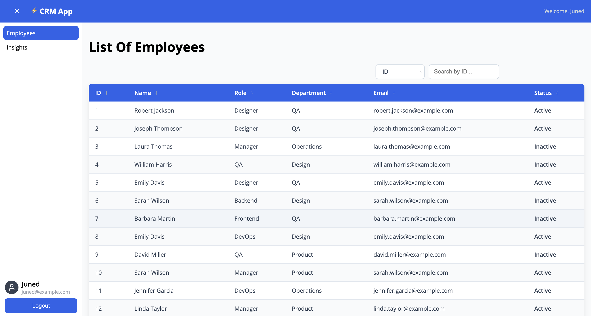
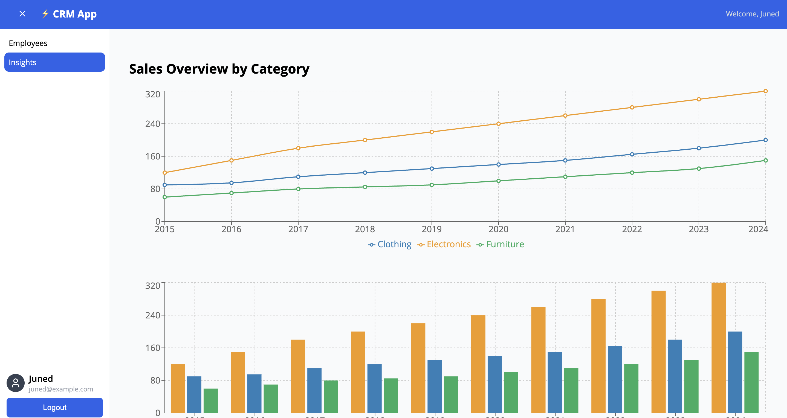

# ⚠️ Work in Progress - CRM App

A CRM application built for mid-to-large sized companies to manage operations efficiently.

## 📸 Screenshots

### 🏠 Dashboard



### 📊 Analytics



## ✨ Features

- 🔐 **Role-based Authentication** and protected routes
- 🎨 **Built-in Design System** (viewable via Storybook using `npm run storybook`)
- 🧩 **Reusable Components** like Tables with dynamic data, search, sorting, and filtering out-of-the-box
- 📈 **Interactive Charts** for analytics
- 🌐 **Network Interceptors** for API timeout handling

## 🛠 Getting Started

1. Clone or download the repository
2. Install dependencies:
   ```bash
   npm install
   ```
